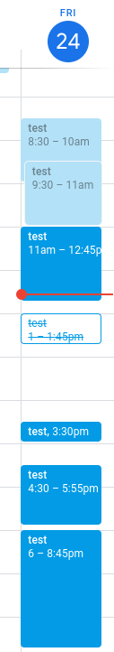
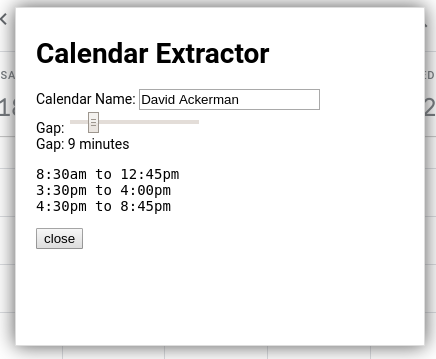

# Calendar Syncing bookmarklet

## What is it

This is a small utility that can extract "free/busy" times from your
Google Calendar. This can be useful when you cannot share your
calendar itself with someone, but do want them to know when you are
busy.

This is a small JavaScript bookmarklet that runs on your Google
Calendar.  When you click it, a popup window gives you the option to
choose the calendar it looks for.

### Screenshot
For the following calendar (note overlaps and a <9 minute gap):

This would be the result

## How to build
Compiling will recreate the dist/ folder with two files:
* bookmarklet.js  -- Paste this entire text as a bookmark (or make a link to it)
* bookmarklet.md5 -- an MD5 hash of the code, in case you want to know whether you have the latest

### Prerequisites
* Linux-like machine
* Some version of java to run the closure compiler

### To build
* ./compile.sh
